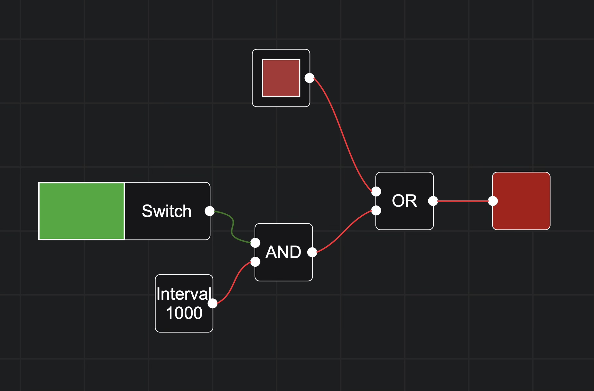

# Logic Nodes

A free online logic gate simulator, hand-written in TypeScript on an HTML5 canvas.

**Try it: [nodes.kriyak.com](https://nodes.kriyak.com/)**, no account, no install. New here? Start at the [about page](https://nodes.kriyak.com/about).



## Features

Simulation:

- AND, OR, NOT, XOR, NOR, and NAND gates
- Clock, delay, counter, button, toggle, and display nodes for time-dependent circuits
- Tick-based propagation, so feedback circuits (SR latches and friends) behave deterministically

Algebra:

- Truth table generation from any circuit
- Boolean expression generation, with optional simplification (requires a Wolfram Alpha App ID)
- The reverse direction too: construct a circuit from a boolean expression or a filled-in truth table

Editor:

- Custom nodes: package any circuit into a reusable component
- Pan, zoom to cursor, undo/redo, copy/paste, layers, and a minimap (ctrl+m)
- Keyboard shortcuts (ctrl+? for the overview)
- Save/load in the browser (localStorage), file import/export, and circuits encoded into the URL for sharing
- Built-in examples, including a working calculator

## Development

```bash
pnpm install
pnpm dev      # start the dev server
pnpm build    # production build
pnpm test     # playwright tests
```

The whole editor is hand-written: rendering happens on a canvas with no diagramming library, and only the menus use Svelte. The interesting parts (viewport culling, high-DPI handling, hitboxes, the tick system) live in `src/nodesystem/`. I wrote up the lessons from building it here: [Hand-writing a canvas node editor in TypeScript](https://kriyak.com/blog/hand-writing-a-canvas-node-editor/).

## About

Built by [Sem](https://kriyak.com/), a freelance software developer. There's a short [project page](https://kriyak.com/project/logic-nodes/) on my site as well.

Licensed under Apache 2.0.
