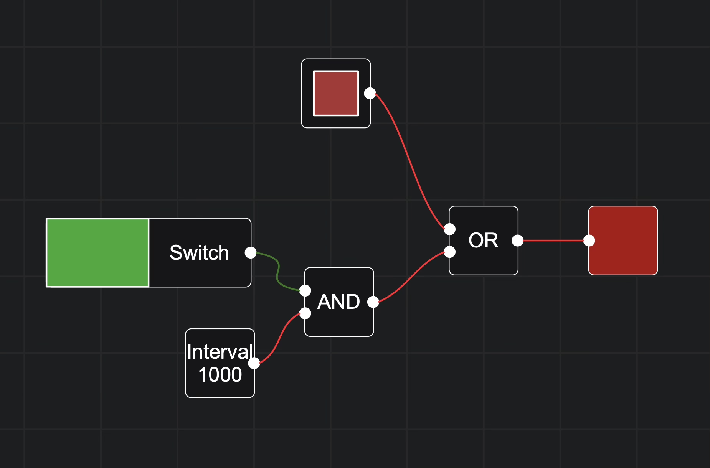

# Logic Nodes

A free online logic gate simulator, hand-written in TypeScript on an HTML5 canvas.

**Try it: [logicgates.org](https://logicgates.org/simulator)**, no account, no install. New here? Start at the [home page](https://logicgates.org/).



## Features

Simulation:

- AND, OR, NOT, XOR, NOR, and NAND gates
- Interval (clock), delay, counter, button, toggle, and display nodes for time-dependent circuits
- Tick-based propagation, so feedback circuits (SR latches and friends) behave deterministically

Algebra:

- Truth table generation from any circuit
- Boolean expression generation, with optional simplification (requires a Wolfram Alpha App ID)
- The reverse direction too: construct a circuit from a boolean expression or a filled-in truth table

Editor:

- Custom nodes: package any circuit into a reusable component
- Pan, zoom to cursor, undo/redo, copy/paste, layers, and a minimap (ctrl+m)
- Keyboard shortcuts (ctrl+/ for the overview)
- Save/load in the browser (localStorage, with autosave) and file import/export as JSON
- Copy a selection to the clipboard as JSON that pastes onto someone else's canvas
- Built-in examples open straight from a link, e.g. `/simulator#example:Calculator`
- Built-in examples, including a working four bit calculator

## The site around it

The editor is one page of a larger reference site, all statically prerendered from the same
codebase:

- **Learn**: a guided path from one gate to a four bit adder, plus references for the
  [six gates](https://logicgates.org/logic-gates), their
  [symbols](https://logicgates.org/logic-gate-symbols),
  [flip-flops](https://logicgates.org/flip-flops),
  [common circuits](https://logicgates.org/common-circuits) and the
  [laws of boolean algebra](https://logicgates.org/boolean-algebra-laws).
- **[Tools](https://logicgates.org/tools)**: truth tables, boolean simplification, Karnaugh maps
  with don't cares, SOP/POS, NAND/NOR conversion, Gray code, and a circuit diagram generator that
  exports SVG or PNG.
- **[Practice](https://logicgates.org/practice)** and a
  [worksheet generator](https://logicgates.org/worksheet) with an answer key, both driven by a
  seeded question generator, so a link reproduces the exact same questions with no account or
  database involved.

Every truth table, identity and gate count on those pages is generated by `src/lib/boolean.ts` and
checked by a property-based test suite, so the published content cannot drift from the maths.

## Development

```bash
pnpm install
pnpm dev      # start the dev server
pnpm build    # production build
pnpm test     # playwright tests
pnpm og       # regenerate the social cards (needs Chrome)
pnpm cards    # regenerate the gate reference images
```

The whole editor is hand-written: rendering happens on a canvas with no diagramming library, and only the menus use Svelte. The interesting parts (viewport culling, high-DPI handling, hitboxes, the tick system) live in `src/nodesystem/`. I wrote up the lessons from building it here: [Hand-writing a canvas node editor in TypeScript](https://kriyak.com/blog/hand-writing-a-canvas-node-editor/).

## About

Built by [Sem](https://kriyak.com/), a freelance software developer. There's a short [project page](https://kriyak.com/project/logic-nodes/) on my site as well.

Licensed under Apache 2.0.
